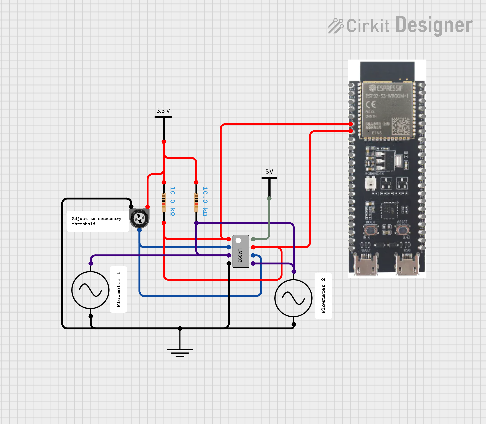

# ESP32 Flow Meter
This project is a simple flow meter driver using an ESP32 and comparator. The ESP32 will read the pulses from the sensor and calculate the flow rate and total volume of water that has passed through the sensor.

## Hardware
This project was made using a bare flow meter that behaves similarly to a generator, producing a sinusoidal waveform with a frequency proportional to the flow rate. An LM393 comparator was used to convert the sinusoidal waveform to a square wave that can be read by the ESP32. The ESP32 was used to read the pulses from the comparator and calculate the flow rate and total volume of water that has passed through the sensor based on the specified conversion factor. The configuration of the pulse generation hardware is shown in the schematic below:

  
  

